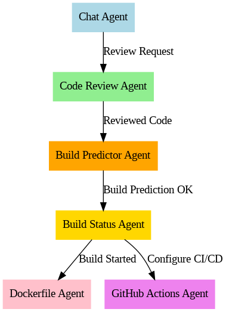
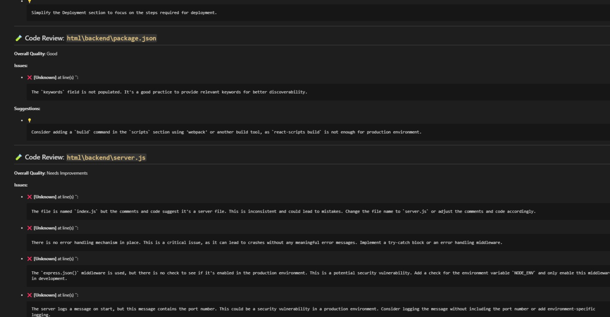
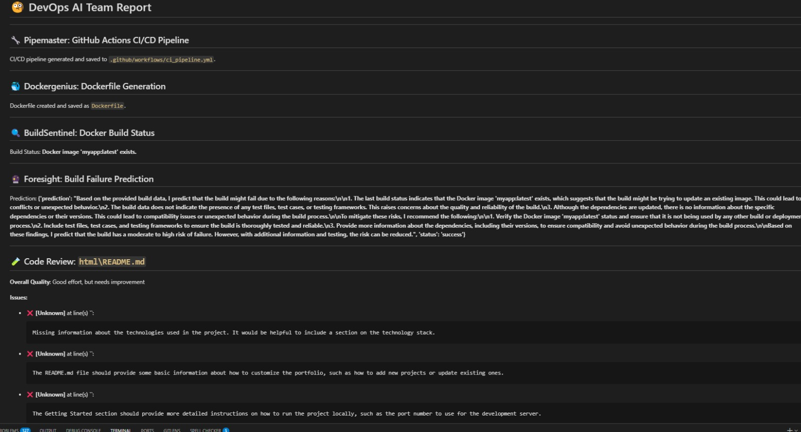
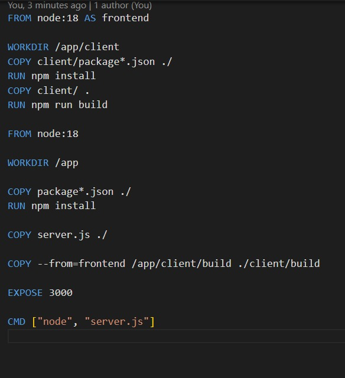
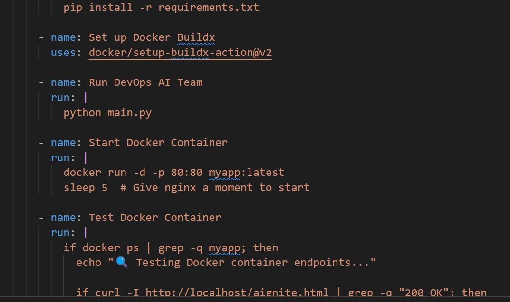

# 🤖 AURA: Autonomous Unified Release Agents

[](LICENSE)
[](https://www.python.org/)
[](#)

> **Modular, AI-Driven CI/CD Orchestration with Multi-Agent Intelligence**  
> Automate your software release pipelines across Code, Build, Test, Deploy, and Monitor.

---

## 🧩 Problem Statement

Current DevOps practices are hindered by manual interventions, tooling fragmentation, failure blindspots, and scalability complexity.  
These inefficiencies break velocity and scalability — necessitating a solution to fully automate and intelligently orchestrate the software development lifecycle.

---

## 💡 Solution

**AURA** – *Autonomous Unified Release Agents* – is a multi-agent, modular platform offering:

- 🤖 **Intelligent orchestration**
- ⚡ **Real-time responsiveness**
- 📈 **Effortless scalability**

It features autonomous agents specialized in:

> 🧑‍💻 **Code** • 🏗️ **Build** • 🧪 **Test** • 🚀 **Deploy** • 📊 **Monitor** • 📣 **Notify**

These agents are centrally orchestrated and communicate asynchronously via **REST APIs** or event buses like **Kafka/RabbitMQ**.

---

## ✨ Key Features

- 🧠 **AI-Driven Workflow Configs** – Pulls smart configurations via GROQ API
- ⚙️ **Multi-Agent Architecture** – Modular, scalable, and autonomous operations
- 📦 **Docker & Python Ready** – Integrated build/test environments
- 🔐 **Secrets Support** – Secured credentials using GitHub Secrets
- 🧪 **Live Endpoint Testing** – Verifies container endpoints
- ⚡ **Optimized CI/CD Flows** – Includes pip caching, matrix builds, and more

---

## 🚀 Demo Usage

```python
# Step 1: Setup configuration
config = GitHubActionsConfig(
    workflow_name="CI/CD Pipeline",
    python_version="3.10",
    run_tests=True,
    groq_api_endpoint="https://api.groq.io/v1/",
    groq_api_key="your-api-key"
)

# Step 2: Initialize agent
agent = GitHubActionsAgent(config)

# Step 3: Fetch updated config from GROQ
agent.fetch_config()

# Step 4: Generate GitHub Actions YAML
print(agent.generate_pipeline())
```
---
🔁 **Workflow Initialized** – Shows the automated DevOps pipeline kicking off with GitHub Actions.

## 🛠 Setup

```bash
git clone https://github.com/your-org/aura-agents.git
cd aura-agents
pip install -r requirements.txt
```
---

## 🔒 Secrets Setup (Required)

Before using the generated workflow, set the following secrets in your GitHub repo:

| Secret Name           | Description                     |
|-----------------------|---------------------------------|
| `GROQ_API_ENDPOINT`   | GROQ API endpoint URL           |
| `GROQ_API_KEY`        | Your GROQ API authentication key |
| `GH_TOKEN`            | GitHub Personal Access Token     |

---
🧠 **Repository Review Completed** – Codebase analyzed for CI/CD, Docker, and compliance setup.



🚀 **Deployment Review Done** – Highlights infrastructure readiness, cost estimate, and HIPAA concerns.


## 🗂 Project Structure
```graphql
aura-agents/
├── github_actions_agent.py     # Core orchestration logic
├── utils/
│   └── groq_client.py          # Handles GROQ API interactions
├── workflows/                  # Auto-generated GitHub Actions YAMLs
├── requirements.txt
└── README.md
```
---

🐳 **Docker Image Built** – Confirms successful creation of `myapp:latest` Docker image.



## ⚙ Tech Stack

- **Programming Language**: Python 3.10+
- **Containerization**: Docker
- **CI/CD**: GitHub Actions
- **Messaging**: Kafka, RabbitMQ
- **API Interaction**: REST APIs
- **Orchestration Intelligence**: GROQ API
- **Data Modeling**: Pydantic

---

⚙️ **CI/CD YAML Generated** – Auto-generated GitHub Actions pipeline for seamless integration and deployment.


## 🤝 Contributing

We welcome contributions from developers and DevOps engineers!  

- Fork the repository  
- Create a feature branch  
- Submit a pull request 🚀

---

## 💬 Contact

Built with ❤️ by the **AURA DevOps Team**.

📬 For feedback or issues, open an [Issue](https://github.com/your-org/aura-agents/issues) or reach out via GitHub.

---
